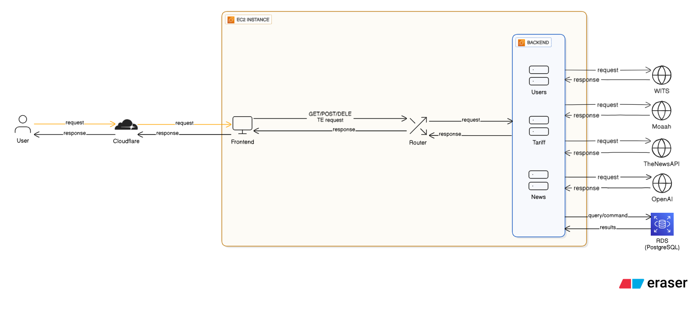

# CSD Tariff Project

[](https://www.docker.com/)
[](https://www.java.com/)
[](https://www.rust-lang.org/)
[](https://reactjs.org/)
[](https://www.postgresql.org/)

A modern, microservices-based tariff calculation system that brings international trade data to your fingertips. From news analysis to precise calculations, we've got your trade needs covered.

## What's This All About?

Ever wondered how much that imported gadget will cost after tariffs? Or want to stay updated on the latest trade news? Our CSD Tariff Project is your one-stop shop for all things tariffs!

This project combines cutting-edge technology with real-world trade data to provide:
- Smart Tariff Calculations
- Real-time News Integration
- User Management
- Seamless API Gateway

## Features

### Core Functionality
- Tariff Calculator: Input your product details and get instant tariff calculations
- News Aggregation: Stay informed with AI-powered news summaries
- User Authentication: Secure JWT-based authentication system
- Chat History: Keep track of your calculation sessions

### Technical Highlights
- Microservices Architecture: Scalable and maintainable
- Docker Orchestration: Easy deployment with docker-compose
- AI Integration: OpenAI-powered news analysis
- Real-time Updates: Live news feeds and calculations

### User Experience
- Modern UI: Sleek React frontend with Tailwind CSS
- Responsive Design: Works on desktop, tablet, and mobile
- Intuitive Interface: No PhD in economics required!


## Tech Stack


### Backend Services
- SpringBoot (Java 21) - Microservices for different features
- Mockito + JUnit - Unit testing
- RestAssured + Spring Framework - Integration testing
- Actix-web (Rust 1.89) - High-performance API gateway and Authentication server
- PostgreSQL - Robust database

### Frontend
- React - Modern UI framework
- Vite - Lightning-fast build tool
- Tailwind CSS - Utility-first styling
- ESLint - Code quality assurance

### DevOps & Tools
- Docker & Docker Compose - Containerization
- JSON Web Token + Argon2 - Secure authentication and encryption
- OpenAI API - AI-powered features
- NewsAPI - Real-time news feeds

## Prerequisites

Before diving in, make sure you have:
- Docker & Docker Compose
- Java 21
- Rust 1.89+
- Node.js 18+
- PostgreSQL (or use our Docker setup)

## Quick Start

### 1. Clone the Repository
```bash
git clone https://github.com/shakeazeez/CSD_TARIFF_PROJECT.git
cd CSD_TARIFF_PROJECT
```

### 2. Environment Setup
```bash
# Copy the environment file
cp .env.example .env

# Edit .env with your API keys and database credentials
# (Don't worry, we've included helpful comments!)
```

### 3. Launch Everything!
```bash
# For development
docker-compose up

# Or for production
docker-compose -f docker-compose.prod.yml up -d
```

### Note: If you want to launch WITHOUT docker
1. Macos (Using package manager homebrew)

FRONTEND
```bash
brew install npm 
cd frontend/tarif-project
npm install 
npm run dev
```

BACKEND
```bash
# For the rust router (note for frontend to connect to any services and any user authentication, this needs to be present)
brew install rustup # Follow all bash/zsh configuration examples provided 
brew install libpq  # Follow all bash/zsh configuration examples provided 
cd backend/router 

# Temporarily set the DYLB library for diesel so it can run
export DYLD_LIBRARY_PATH="/opt/homebrew/opt/libpq/lib:$DYLD_LIBRARY_PATH"
cargo run

# For tariff calculation portion of website 
cd backend/tariffCalc 
./mvnw clean compile && ./mvnw spring-boot:run

# For user logic functionality
cd backend/user 
./mvnw clean compile && ./mvnw spring-boot:run

# For openai and newsapi functinality
cd backend/news 
./mvnw clean compile && ./mvnw spring-boot:run
```

2. For Windows 
FRONTEND
Download: https://nodejs.org
Run 
````powershell
cd frontend\tarif-project
npm 
````

BACKEND
Install Postgres from the following website
https://www.postgresql.org/download/windows/
 
Install Rust with 
````powershell
winget install Rustlang.Rustup
rustup default stable
````
Add postgres paths 

```powershell
setx PQ_LIB_DIR "C:\Program Files\location\to\postgres\install\PostgreSQL\16\lib"
setx PQ_INCLUDE_DIR "C:\Program Files\location\to\postgres\install\PostgreSQL\16\include"
setx PATH "$($env:PATH);C:\Program Files\location\to\postgres\install\PostgreSQL\16\bin"
```

Run router 
```powershell
cd backend\router
cargo install diesel_cli --no-default-features --features postgres
cargo run -release
```

Run service
```powershell
cd backend\tariffCalc 
./mvnw clean compile && ./mvnw spring-boot:run

# For user logic functionality
cd backend\user 
./mvnw clean compile && ./mvnw spring-boot:run

# For openai and newsapi functinality
cd backend\news 
./mvnw clean compile && ./mvnw spring-boot:run
```

3. For Linux 

bops you installed the OS you can figure out how to do it yourself

### 4. Access Your App
- Frontend: http://localhost
- API Gateway: http://localhost:8080
- Tariff Service: http://localhost:8081
- User Service: http://localhost:8082
- News Service: http://localhost:8083
Note: For authentication to work, all request must go through port 8080 as that is where the 
      user authentication logic is stored. 


### API Endpoints
```
GET  /api/news          # Get latest trade news
POST /api/calculate     # Calculate tariff
POST /api/auth/login    # User authentication
GET  /api/history       # Chat history
```

## Development

### Running Tests
```bash
# Backend services
cd backend/news && ./mvnw test
cd tariffCalc && ./mvnw test
cd user && ./mvnw test

# Rust router
cd router && cargo test

# Frontend
cd frontend/tarrif-project && npm test
```

### Code Quality
```bash
# Lint and format
cd frontend/tarrif-project && npm run lint
cd frontend/tarrif-project && npm run format
```

## Docker Deployment

```bash
docker-compose -f docker-compose.prod.yml up -d
```

## Contributing

We love contributions! Here's how you can help:

1. Fork the repository
2. Create a feature branch: `git checkout -b feature/amazing-feature`
3. Commit your changes: `git commit -m 'Add amazing feature'`
4. Push to the branch: `git push origin feature/amazing-feature`
5. Open a Pull Request

### Development Guidelines
- Follow our coding standards
- Write tests for new features
- Update documentation
- Be awesome!

## Project Status

- Backend Services: Fully functional
- Frontend: Complete and responsive
- API Gateway: Routing and authentication
- Database: PostgreSQL integration
- Docker: Containerized deployment
- CI/CD: In progress

## Troubleshooting

### Common Issues
- Port conflicts? Check if ports 8080-8083 are free
- Database connection? Verify your `.env` credentials
- API keys? Make sure your OpenAI and TheNewsAPI keys are valid


## Acknowledgments

- OpenAI for AI-powered features
- TheNewsAPI for real-time news feeds
- PostgreSQL for reliable data storage
- Docker for amazing containerization
- WITS for the past tariff data
- Moaah for the real-time tariff data

## Team

Built by the GoatTariff Team:
- Shake Azeez
- Joseph
- Jing Xi
- Yong Huey
- Shin En

---

Ready to revolutionize tariff calculations? Let's make international trade fun again!

If you find this project helpful, give it a star and share with fellow traders!